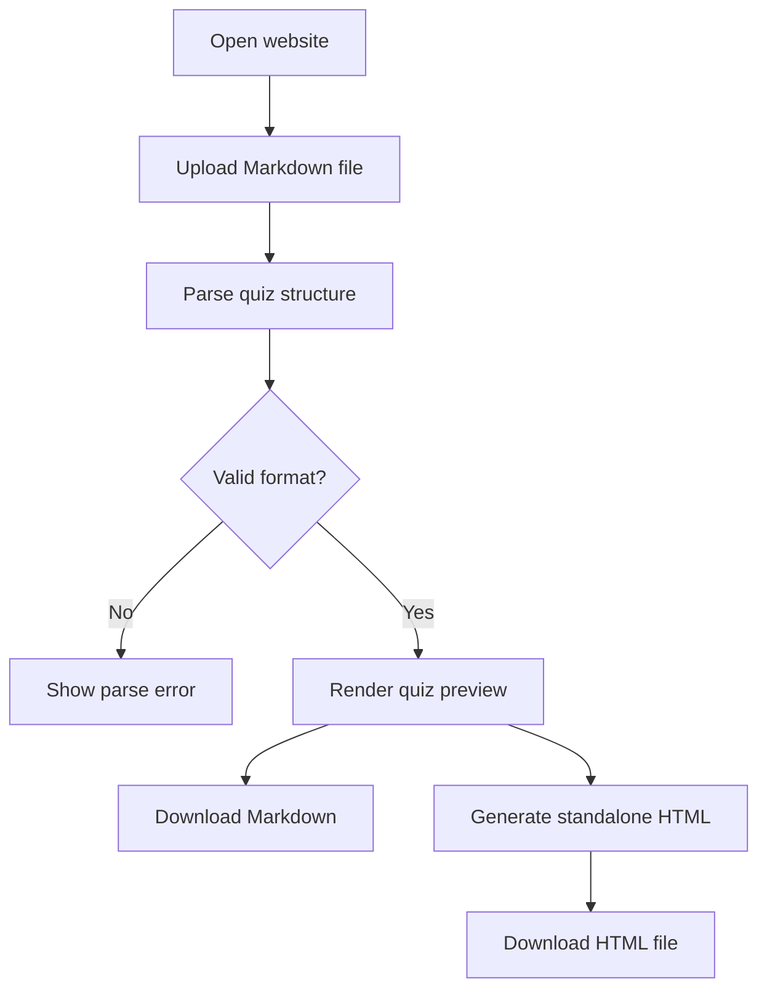

## 1. Product Overview
`mdq2html` is a browser-based tool that turns a quiz-style Markdown file into an interactive HTML quiz and a downloadable standalone HTML artifact.
- It serves teachers, students, and content creators who want to turn structured Markdown quizzes into shareable web pages without a backend.
- Its product value is fast content reuse: one Markdown source can be previewed, tested, exported, and hosted on GitHub Pages.

## 2. Core Features

### 2.1 Feature Module
1. **Converter Workspace**: file upload, source summary, parse status, and action buttons
2. **Quiz Preview**: interactive single-question flow, answer feedback, progress, and final score
3. **Export Actions**: download original Markdown and generated standalone HTML
4. **Deployment Readiness**: static build output suitable for GitHub Pages hosting

### 2.2 Page Details
| Page Name | Module Name | Feature description |
|-----------|-------------|---------------------|
| Home | Upload panel | Accept a local Markdown file and read it in the browser |
| Home | Parse status | Show success or validation errors for the uploaded file |
| Home | Quiz metadata | Show title, description, question count, and source filename |
| Home | Quiz preview | Render a playable quiz with progress, explanations, and summary |
| Home | Export toolbar | Download the source Markdown and generated standalone HTML |
| Home | Help section | Describe the expected Markdown structure and limitations |

## 3. Core Process
The user opens the website, uploads a Markdown file, and gets immediate parse feedback. If parsing succeeds, the app normalizes the quiz into structured data, renders a playable preview, and enables both download actions. The downloaded HTML remains self-contained and can be opened directly or published as a static file.

## 4. User Interface Design
### 4.1 Design Style
- Primary colors: deep slate for structure, bright quiz accents inspired by classroom game interfaces
- Button style: large rounded buttons with strong contrast and clear hover states
- Font and sizes: expressive display font for headings and readable sans font for body content
- Layout style: desktop-first split layout with control panel on top and preview below
- Icon style: lightweight icon accents for upload, download, validation, and quiz progress

### 4.2 Page Design Overview
| Page Name | Module Name | UI Elements |
|-----------|-------------|-------------|
| Home | Header | Product title, short subtitle, and deployment note |
| Home | Upload panel | File input, status badge, supported-format guidance |
| Home | Action bar | Download buttons for Markdown and HTML, disabled states until parse success |
| Home | Preview card | Question stepper, options, feedback, next action, summary state |
| Home | Format guide | Sample Markdown rules, expected markers, and troubleshooting notes |

### 4.3 Responsiveness
Desktop-first layout with adaptive stacking on smaller screens. The quiz interaction remains tap-friendly, buttons stay full-width when narrow, and long content areas wrap cleanly without requiring horizontal scrolling.
