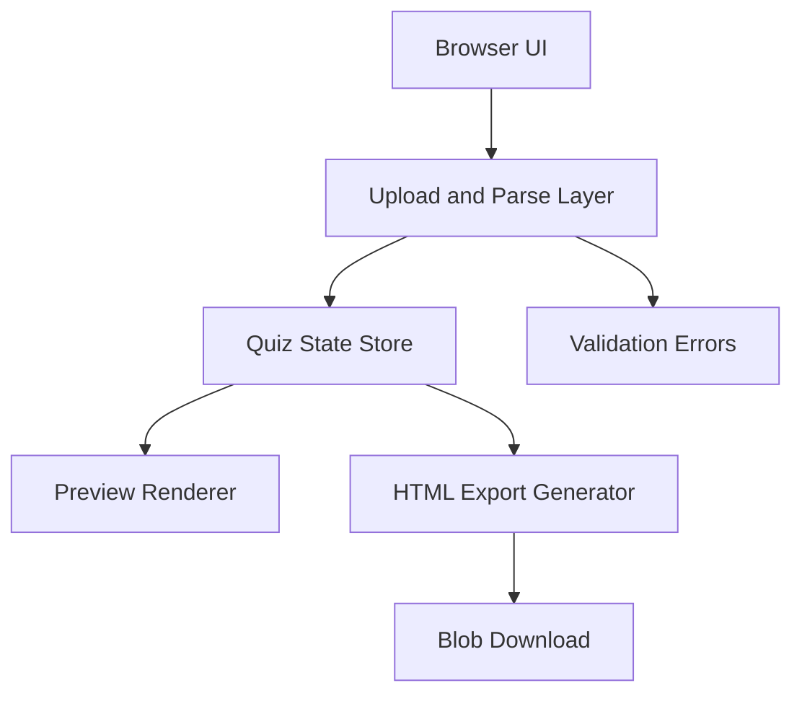
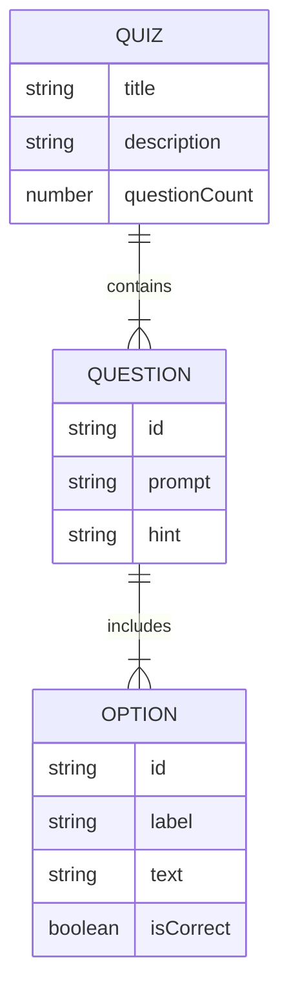

## 1. Architecture Design


## 2. Technology Description
- Frontend: React 18 + TypeScript + Vite
- Styling: Tailwind CSS with small custom theme tokens
- State management: zustand
- Testing: Vitest + React Testing Library
- Deployment: static build published to GitHub Pages

## 3. Route Definitions
| Route | Purpose |
|-------|---------|
| / | Main converter page with upload, preview, and export actions |

## 4. API Definitions
No backend API is required. All parsing, rendering, and exporting run in the browser.

### Type Definitions
```ts
type QuizOption = {
  id: string;
  label: string;
  text: string;
  isCorrect: boolean;
};

type QuizQuestion = {
  id: string;
  prompt: string;
  hint: string;
  options: QuizOption[];
};

type QuizDocument = {
  title: string;
  description: string;
  questionCount: number;
  questions: QuizQuestion[];
};
```

## 5. Server Architecture Diagram
No server layer is required for the initial release.

## 6. Data Model
### 6.1 Data Model Definition


### 6.2 Data Definition Language
No database schema is required because the application does not persist data server-side.

## 7. Implementation Notes
- The parser targets the provided Markdown quiz structure rather than generic Markdown conversion
- The exported HTML is generated from a template function and embedded quiz JSON
- The download workflow uses browser `Blob` objects and object URLs
- GitHub Pages support is implemented via Vite base-path configuration and a deploy workflow
